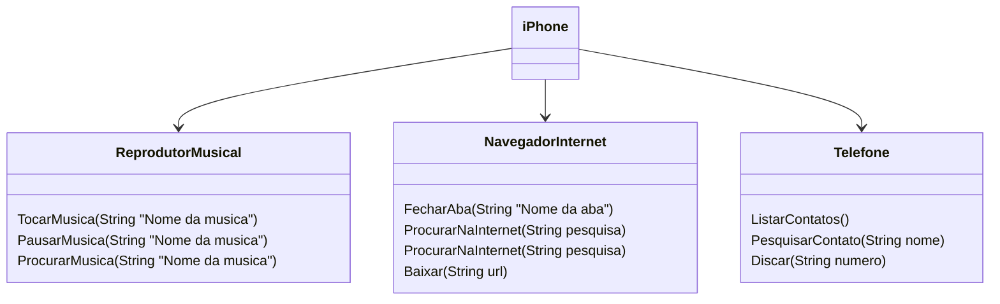

# Iphone UML

```mermaid
classDiagram
    class ReprodutorMusical {
        TocarMusica(String "Nome da musica")
        PausarMusica(String "Nome da musica")
        ProcurarMusica(String "Nome da musica")
    }

    class NavegadorInternet {
        FecharAba(String "Nome da aba")
        ProcurarNaInternet(String pesquisa)
        ProcurarNaInternet(String pesquisa)
        Baixar(String url)
    }
    class Telefone {
        ListarContatos()
        PesquisarContato(String nome)
        Discar(String numero)
    }
    

    class iPhone {
    }

    iPhone --> ReprodutorMusical
    iPhone --> NavegadorInternet
    iPhone --> Telefone


```
